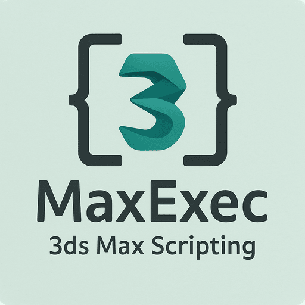

# MaxExec

**MaxExec** for VS Code
Write and execute MaxScript code directly from Visual Studio Code. This extension provides syntax highlighting, contextual snippets for MaxScript constructs like fn, rollout, struct, if, for, and more, plus basic autocomplete powered by a growing library of built-in functions and object APIs.

---

## ✨ Features

- 🔍 **3ds Max Instance Detection**  
  Automatically detects running 3ds Max instances for script execution.

- 🚀 **Send Scripts to Max**  
  Send full files or selected code directly to your chosen 3ds Max instance.

- 🧠 **Syntax Highlighting**  
  Provides syntax highlighting and snippets for `.ms` and `.mcr` MaxScript files.

- 💡 **Snippets**  
  Includes useful MaxScript snippets for common structures like if-statements, loops, and function declarations.

- 💡 **Icons**  
  Includes icons for all known 3ds MaxScript related file types.
---

## 🛠 Commands

| Command | Description |
|--------|-------------|
| `MaxExec: Select 3ds Max Instance` | Choose a running instance of 3ds Max |
| `MaxExec: Send Full File to 3ds Max` | Sends the entire current file |
| `MaxExec: Send Selection to 3ds Max` | Sends the selected text or current line |

### 🔑 Keybindings

| Keybinding | Action |
|-----------|--------|
| `Ctrl+Shift+E` | Send full file |
| `Ctrl+Shift+S` | Send selection or current line |
| `Ctrl+Alt+E` | Select 3ds Max instance |

---

## 📦 Snippet Examples

Examples of available snippets:

- `if`, `ifelse`, `ifdo`
- `while`, `for`, `foreach`
- `fn`, `struct`, `rollout`
- `case`

These are available via the **MaxScript** language mode.

---

## ⚙ Requirements

- 🛠 Autodesk 3ds Max must be running.
- 🟦 Requires the included `maxexec-messanger.exe` tool to be able to communicate with 3ds Max.

---

## 🔧 Installation

1. Clone or download this extension.
2. Run `npm install` and `npm run build` to compile.
3. Launch with VS Code Extension Development Host.
4. Open a `.ms` or `.mcr` file and start scripting.

---

## 🧪 Troubleshooting

- ❌ **No 3ds Max instances found**: Ensure 3ds Max is running and not blocked by firewall or permissions.
- ⚠ **Script didn't execute**: The selected Max instance may have closed—reselect it via `MaxExec: Select Instance`.

---

## 📄 License

MIT

---

## 📷 Icon

